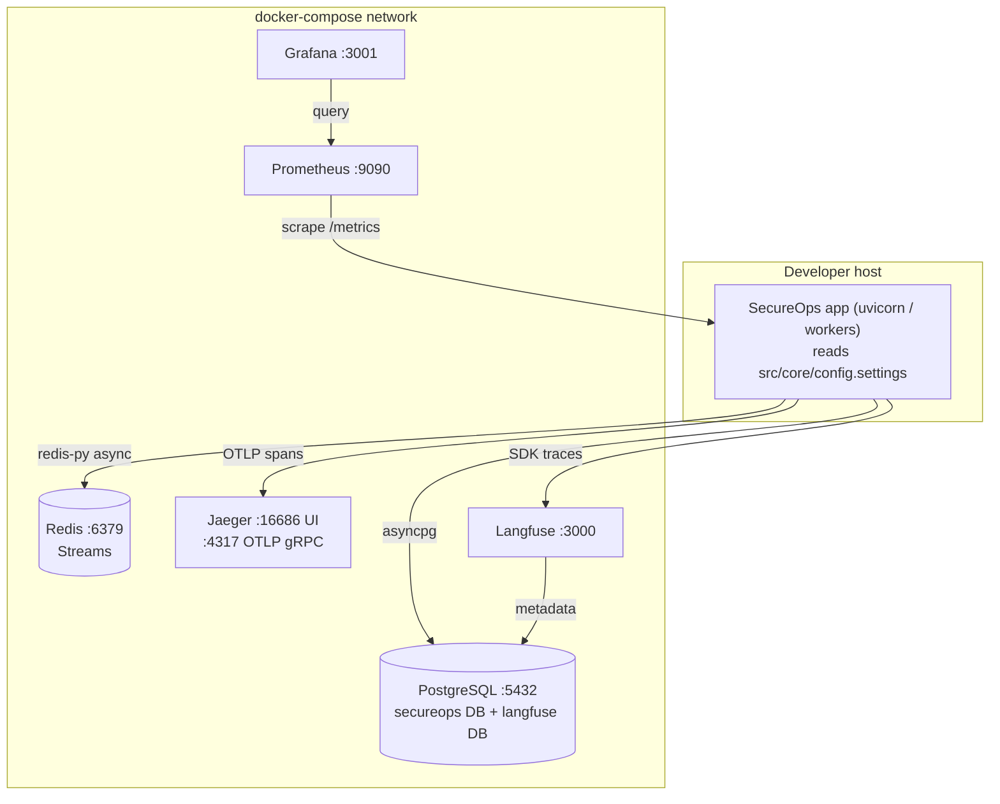
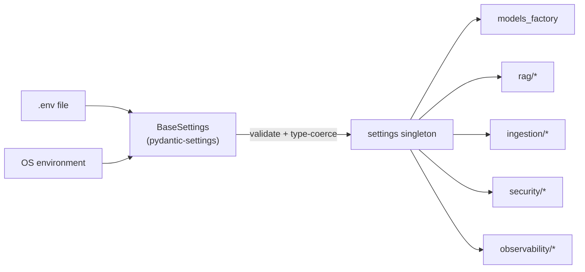

# M1 — Project Scaffold & Config · Architecture

## Service topology (local dev via Docker Compose)



## Configuration loading flow



## Key decisions
- **Single settings singleton.** One `Settings(BaseSettings)` instance exported as `settings`. Every
  module imports it; no module reads `os.environ` directly. This makes the configuration surface
  auditable and testable (override via env in tests).
- **UV as source of truth, requirements.txt as artifact.** `pyproject.toml` declares dependencies;
  `uv.lock` pins them; `uv export` produces `requirements.txt` for Docker layers that pip-install.
- **Fail-fast validation.** Required secrets are typed (no silent `None`); the app refuses to start
  with an invalid config rather than failing deep inside an agent run.
- **Provider-extra dependencies are optional.** OpenAI/Anthropic SDKs are *extras* — base install runs
  on free Groq + local HuggingFace embeddings with zero paid-API dependencies.

## Directory contract (frozen here, filled later)
```
src/core | src/ingestion/{adapters,queue} | src/agents | src/graph | src/rag
src/security | src/observability | src/workers | src/api/routes
docs/<Mxx-*> | data/seed_runbooks | tests/{unit,integration}
```
Later milestones add files into these directories but never restructure them.
