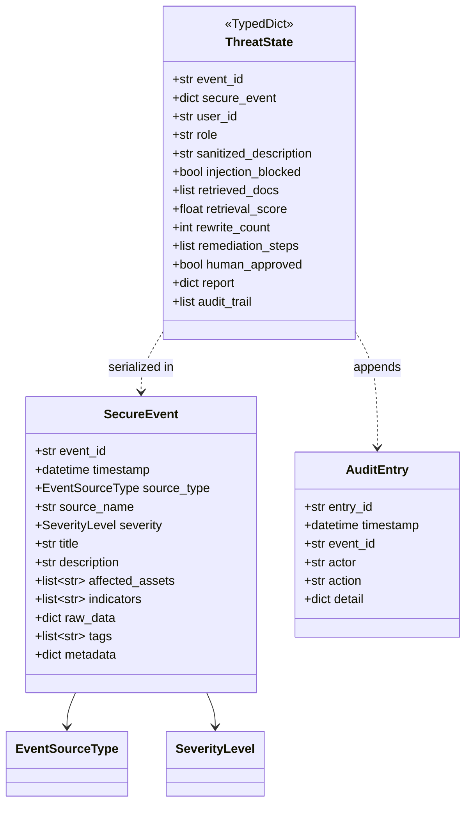
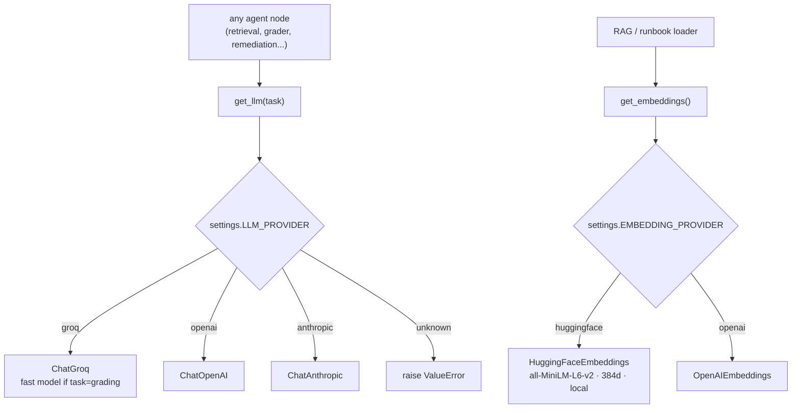

# M2 — Core Schema & Model Factory · Architecture

## Schema relationships

## Model factory — the single swappable layer

## Key decisions
- **Lazy provider imports.** Each `if provider == ...` branch imports its SDK inside the branch.
  Base install depends only on `langchain-groq` + `langchain-huggingface`; OpenAI/Anthropic are extras
  documented in `docs/models.md`. This keeps Denial-of-Wallet surface minimal and install light.
- **`task` parameter, not separate functions.** Callers express *intent* ("grading" = cheap) and the
  factory maps intent → concrete model. Adding a new task tier touches one function.
- **Embeddings dimension is config, not code.** `EMBEDDING_DIMENSION=384` flows to Pinecone index
  creation (M4); swapping to a 1536-dim OpenAI embedder is an env change + reindex, no code change.
- **Schema is the boundary.** `raw_data` carried for forensics but flagged non-LLM-safe; the graph
  reads `sanitized_description`, never `raw_data`.

## Swap procedure (documented in docs/models.md)
1. `pip/uv add` the provider extra (e.g. `langchain-openai`).
2. Set `LLM_PROVIDER=openai` and `OPENAI_API_KEY=...` (and/or `EMBEDDING_PROVIDER=openai`).
3. If embedding dimension changes, update `EMBEDDING_DIMENSION` and re-seed Pinecone (M4 loader).
4. No application code changes.
