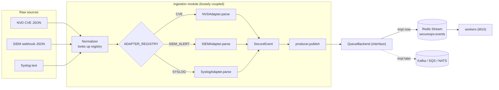
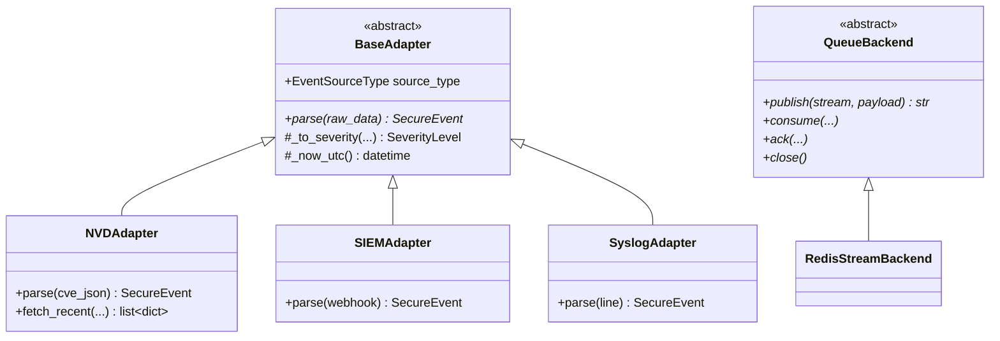

# M3 — Ingestion & Adapters · Architecture

## Normalization + publish flow

## Adapter class hierarchy

## Key decisions
- **Registry over conditionals.** `ADAPTER_REGISTRY: dict[str, type[BaseAdapter]]`. `Normalizer`
  resolves by `source_type` hint; unknown hints raise a clear error. No central switch to edit per
  source — the registry is the extension point.
- **Parse ≠ fetch.** Adapters are pure `dict -> SecureEvent` so they unit-test offline against
  fixtures. Network fetching (NVD REST) lives in a separate method used only by scheduled ingest.
- **Queue behind an interface.** Producer signature never mentions Redis. `get_queue_backend()` (a
  small factory, mirroring the model factory pattern) returns the configured backend so transport is a
  one-line swap (principle #3).
- **`raw_data` quarantine.** Original payload is stored verbatim on the event for forensics/audit but
  is structurally separate from the normalized text the agents will consume.

## Adding a new source (the documented 2-step path)
1. Create `src/ingestion/adapters/<x>_adapter.py` with a `BaseAdapter` subclass implementing `parse`.
2. Register it: `ADAPTER_REGISTRY[EventSourceType.X] = XAdapter`.
No changes to `Normalizer`, `producer`, the queue, or any agent.
