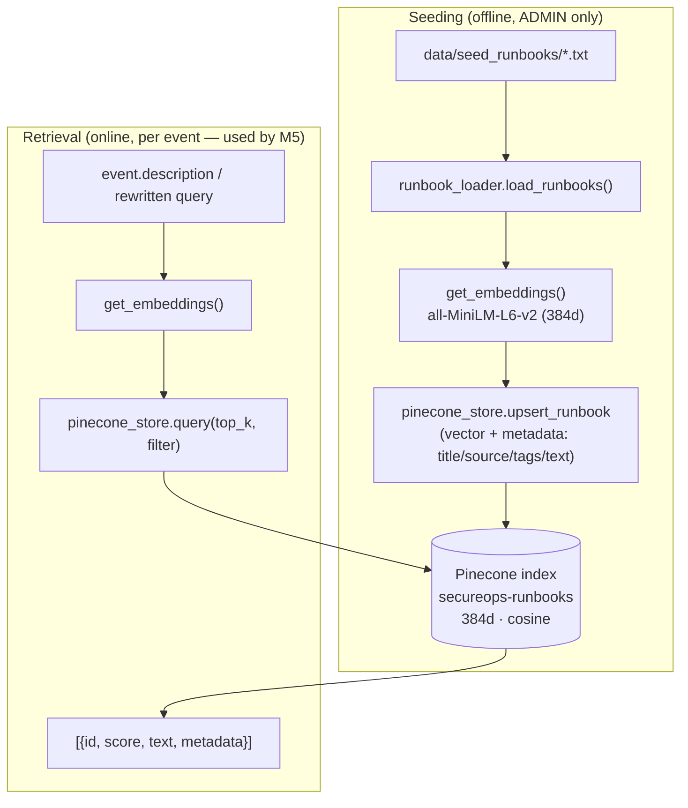
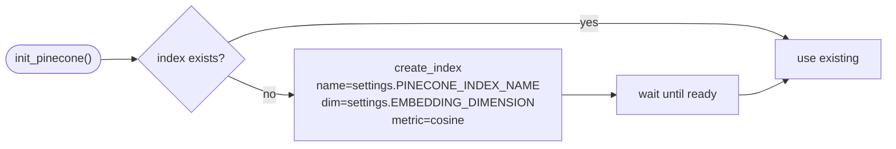

# M4 — RAG & Runbook Seeding · Architecture

## Seeding (write path) and retrieval (read path)

## Index lifecycle

## Key decisions
- **Embeddings via the M2 factory.** RAG never constructs an embedder directly — it calls
  `get_embeddings()`. Dimension flows from `settings.EMBEDDING_DIMENSION` into index creation, so
  model and index stay consistent by construction.
- **Text-in-metadata.** Pinecone stores vectors; we keep the runbook `text` in metadata so retrieval
  returns displayable, citable content in one round trip (no second store to join against).
- **Metadata filter is a first-class query arg.** Retrieval guardrails (trusted-source-only,
  tag-scoped) are available from day one, not retrofitted — directly addressing retrieval poisoning.
- **Write path is privileged.** Seeding + future runbook CRUD are the *only* vector writers and are
  ADMIN-gated (M9), keeping the knowledge base trustworthy.

## Interfaces consumed downstream
- M5 `retrieval` node → `pinecone_store.query(...)`
- M9 runbook routes (ADMIN) → `upsert_runbook(...)` / delete
- M11 eval → seeds a labeled set + measures retrieval/grounding quality
