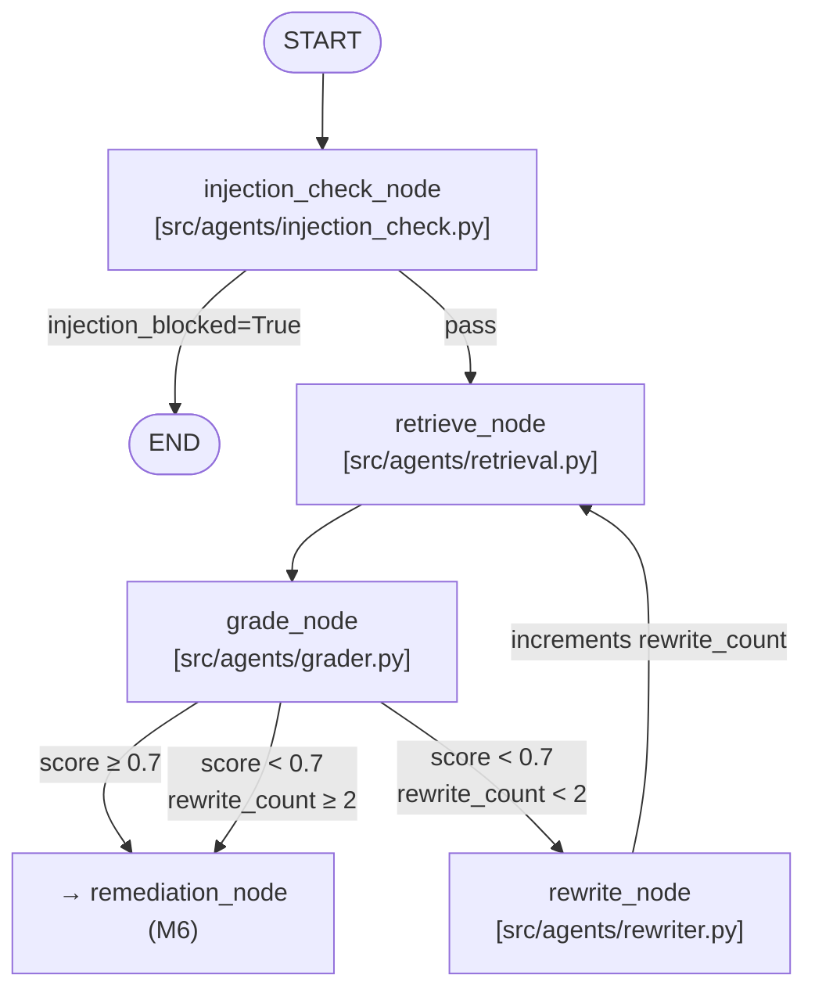
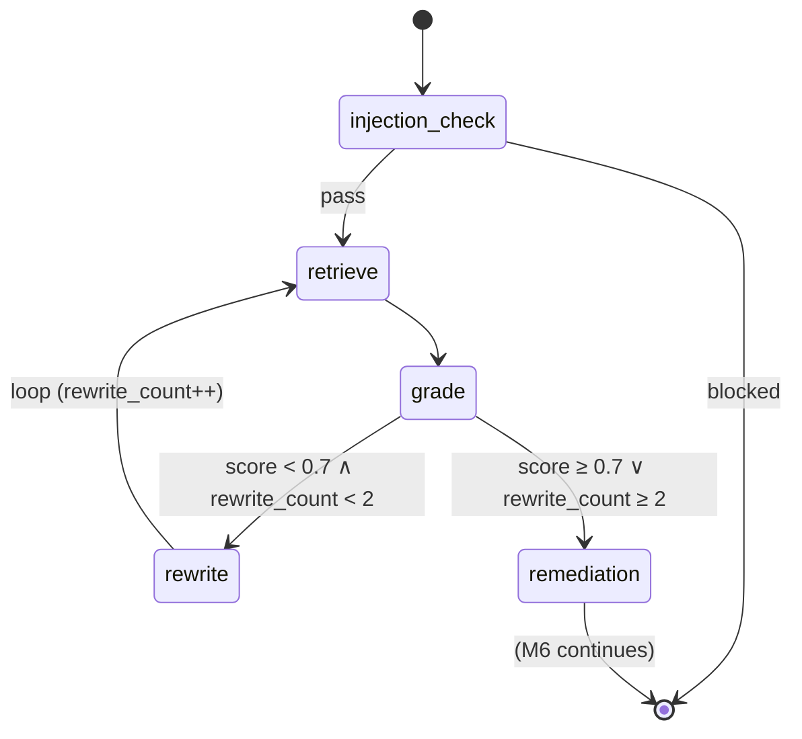
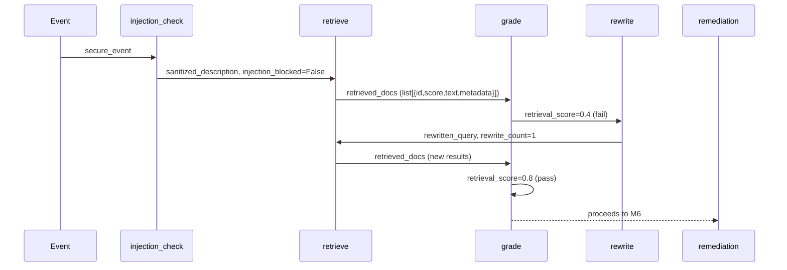
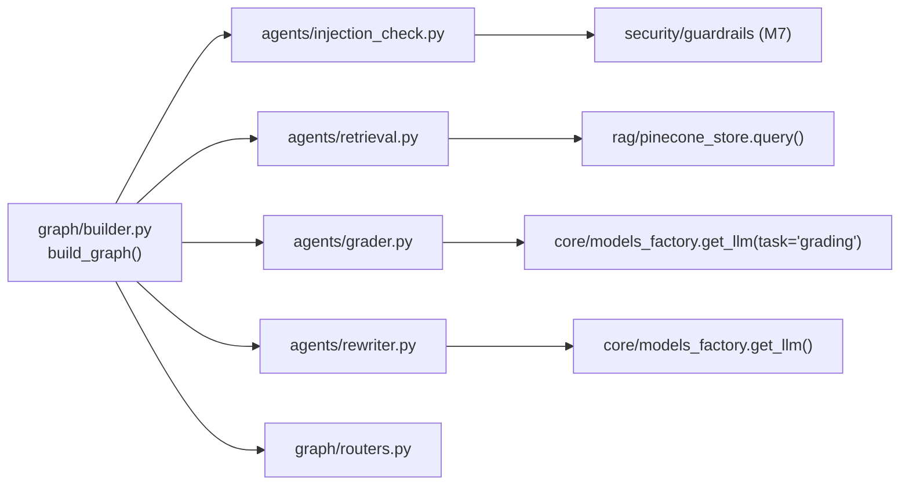

# M5 — Agent Graph (Part 1) · Architecture

## Graph topology (M5 scope)

## State machine

## ThreatState field lifecycle (M5 nodes)

## Key module relationships

## Decisions

- **All nodes are `async def`.** The graph is invoked via `ainvoke()`. Blocking
  calls (Pinecone) are wrapped in `asyncio.to_thread` inside `pinecone_store`.
- **Routers are pure functions** (`state → str`). No IO, no side effects, fully unit-testable.
- **`MemorySaver` is the default checkpointer.** In-process, zero deps. Production
  (M9+) replaces it with `AsyncPostgresSaver` — one argument to `build_graph()`.
- **The loop is expressed as a graph edge** (`rewrite → retrieve`), not recursion or
  a while loop inside a node. LangGraph handles the loop state transparently.
- **`rewrite_count` is initialized to 0 by the injection_check node** on first entry,
  eliminating the need for callers to pre-populate it.
