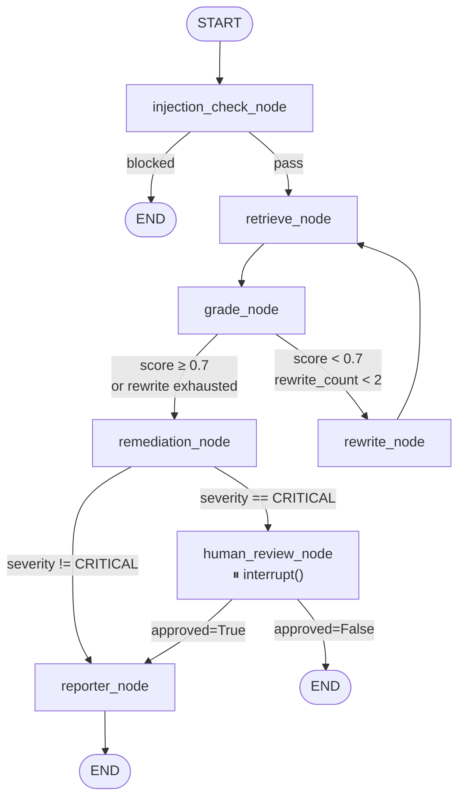
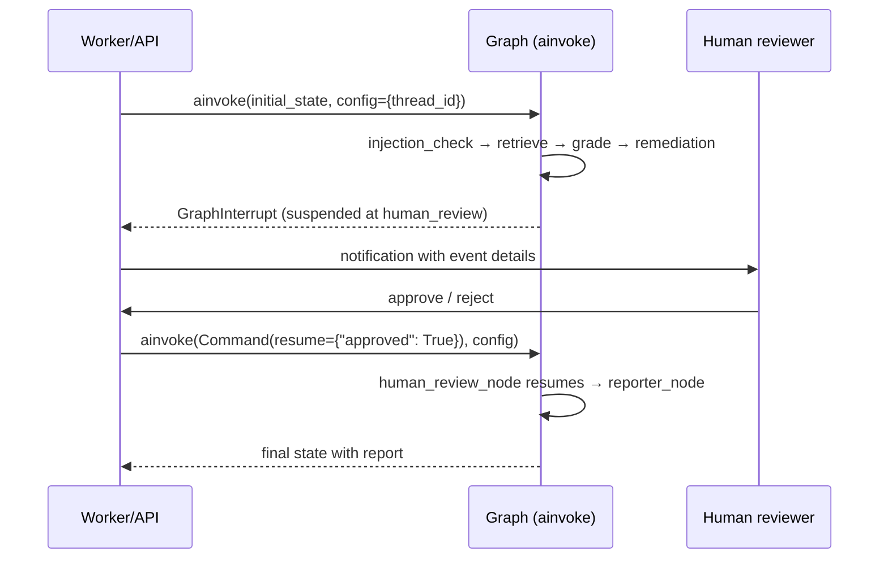

# M6 — Agent Graph (Part 2) · Architecture

## Complete graph topology

## HITL sequence

## Full node catalogue

```mermaid
classDiagram
    class injection_check_node {
        +reads: secure_event
        +writes: sanitized_description, injection_blocked
        +impl: L1 regex (M5), L2 LLM (M7)
    }
    class retrieve_node {
        +reads: sanitized_description | rewritten_query
        +writes: retrieved_docs
        +calls: pinecone_store.query()
    }
    class grade_node {
        +reads: sanitized_description, retrieved_docs
        +writes: retrieval_score
        +model: get_llm(task="grading")
    }
    class rewrite_node {
        +reads: sanitized_description, rewrite_count
        +writes: rewritten_query, rewrite_count+1
        +strategy: HyDE
        +model: get_llm()
    }
    class remediation_node {
        +reads: sanitized_description, retrieved_docs, severity
        +writes: remediation_steps, severity
        +model: get_llm()
    }
    class human_review_node {
        +reads: event_id, severity, remediation_steps
        +writes: human_approved
        +mechanism: interrupt()
    }
    class reporter_node {
        +reads: all state
        +writes: report dict
        +side_effect: audit flush (M7)
    }
```

## Key decisions

- **`interrupt()` not `interrupt_before`.** Using `interrupt()` inside the node keeps
  the HITL contract visible at the node level, not buried in compile options.
  The caller uses `Command(resume=...)` to pass the human's decision back.
- **Remediation is grounded by contract.** The prompt explicitly requires citing
  retrieved runbooks. If no docs were retrieved, the prompt says so and the LLM
  is instructed to flag uncertainty rather than hallucinate steps.
- **Reporter audit flush is stubbed in M6.** The `audit_trail` list is fully populated
  by this point. The DB write (`src.db.engine` + `audit_entries` table) is wired in M7
  so the test surface for M6 stays focused on graph correctness, not DB integration.
- **`build_graph(checkpointer=None)` is the single public API** for graph construction.
  All node imports happen inside this function to keep the module importable without
  triggering heavy imports (embeddings, Pinecone client, etc.) at import time.
