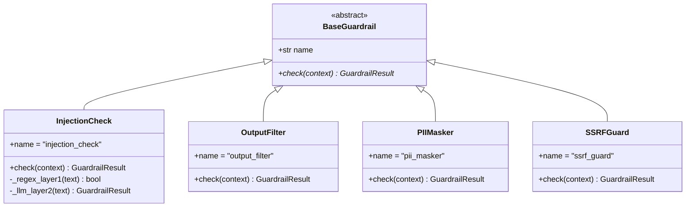
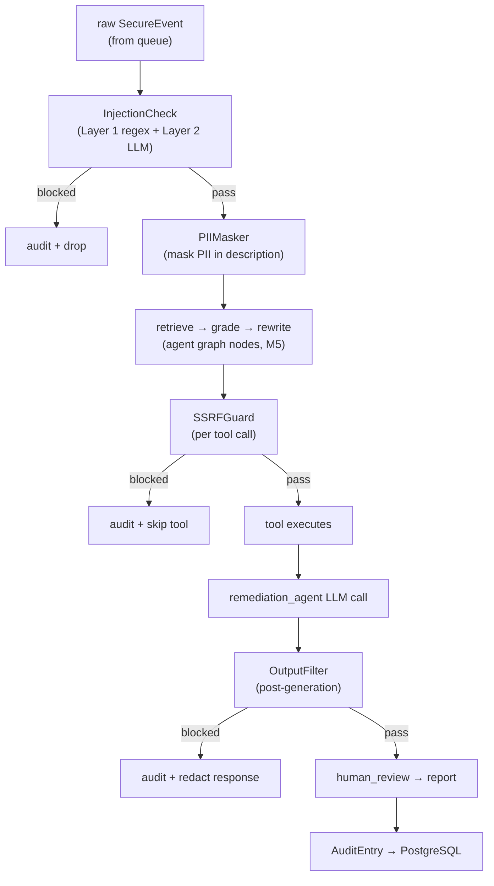

# M7 — Security Layer · Architecture

## Guardrail class hierarchy (mirrors adapter pattern)



## Pipeline placement in the agent graph



## RBAC enforcement points

```mermaid
flowchart LR
    req["HTTP Request\nBearer JWT"] --> mw["JWT decode\nrequire_role dependency"]
    mw -->|invalid / wrong role| r403["403 Forbidden"]
    mw -->|valid| route["route handler"]
    route --> graph["graph.invoke()\nrole passed in ThreatState"]
    graph --> hitl["human_review node\nchecks role ≥ ENGINEER"]
    graph --> runbook["runbook write\nchecks role = ADMIN"]
```

## Key decisions
- **Guardrail pipeline is composable, ordered, short-circuits on block.** Same
  philosophy as the adapter registry: one class per threat, registered in one
  place, testable in isolation.
- **PIIMasker mutates rather than blocks.** PII is masked in-place
  (`context["masked_text"]`) so downstream nodes see clean text; the original is
  preserved only in `raw_data` (quarantined, never reaches LLM).
- **Audit is immutable by construction.** `operator.add` in `ThreatState` means
  nodes can only append; the audit table uses a restricted DB role without UPDATE/DELETE.
- **RBAC checked twice**: at the API edge (FastAPI dependency) and inside the
  graph (for HITL and privileged operations), so neither layer is the sole enforcer.
- **Injection check runs before the first LLM call without exception.** It is
  not a feature that can be opted out of at the route level.
