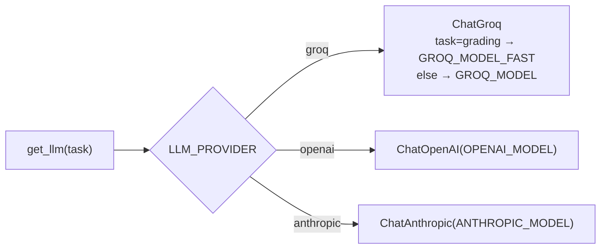

# Model Swap Guide

SecureOps AI is **model-swappable by configuration**. All LLM and embedding
clients are built in one place — [`src/core/models_factory.py`](../src/core/models_factory.py)
via `get_llm(task)` and `get_embeddings()`. No application code constructs a
model directly, so switching providers never requires touching agent, RAG, or
API code.

## How the factory chooses a model



The `task` argument expresses **intent**: cheap nodes (e.g. the retrieval
grader) call `get_llm("grading")` and get a smaller/faster model; complex nodes
(remediation) call `get_llm()` and get the high-quality default.

## Default (free) configuration

| Concern | Provider | Model | Cost |
|---|---|---|---|
| LLM | Groq | `llama-3.3-70b-versatile` (fast tier: `llama-3.1-8b-instant`) | free tier, 30 req/min |
| Embeddings | HuggingFace (local) | `all-MiniLM-L6-v2`, 384-dim | none (runs on CPU) |

Base install (`uv sync`) pulls only `langchain-groq` + `langchain-huggingface`.

## Switching the LLM provider

Each provider's SDK is an **optional extra**, imported lazily only when selected.

### → OpenAI
```bash
uv sync --extra openai            # installs langchain-openai
```
```dotenv
LLM_PROVIDER=openai
OPENAI_API_KEY=sk-...
OPENAI_MODEL=gpt-4o-mini
```

### → Anthropic
```bash
uv sync --extra anthropic         # installs langchain-anthropic
```
```dotenv
LLM_PROVIDER=anthropic
ANTHROPIC_API_KEY=sk-ant-...
ANTHROPIC_MODEL=claude-3-5-haiku-20241022
```

No other changes. Restart the app/workers to reload `settings`.

## Switching the embedding provider

Embeddings determine the Pinecone index dimension, so changing them requires a
**re-seed**.

### → OpenAI embeddings
```bash
uv sync --extra openai
```
```dotenv
EMBEDDING_PROVIDER=openai
EMBEDDING_MODEL=text-embedding-3-small
EMBEDDING_DIMENSION=1536
```
Then recreate + re-seed the index:
```bash
uv run python -m src.rag.runbook_loader   # init_pinecone() creates a 1536-dim index
```
> If an index already exists at the old dimension, delete it in the Pinecone
> console first (or point `PINECONE_INDEX_NAME` at a new name).

## Adding a brand-new provider

1. Add the SDK as an optional extra in `pyproject.toml`.
2. Add one `if provider == "<name>":` branch in `get_llm` (and/or
   `get_embeddings`) in `models_factory.py`, importing the SDK inside the branch.
3. Add the provider to the `LLM_PROVIDER` `Literal` in `src/core/config.py` plus
   any `<NAME>_API_KEY` / `<NAME>_MODEL` settings and `.env.example` entries.
4. Document it in the table above.

That is the complete change set — one factory function, one config enum, one doc.
